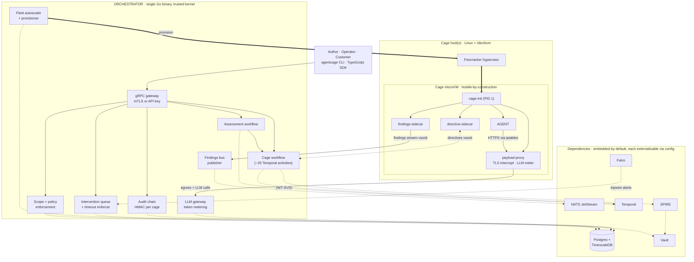
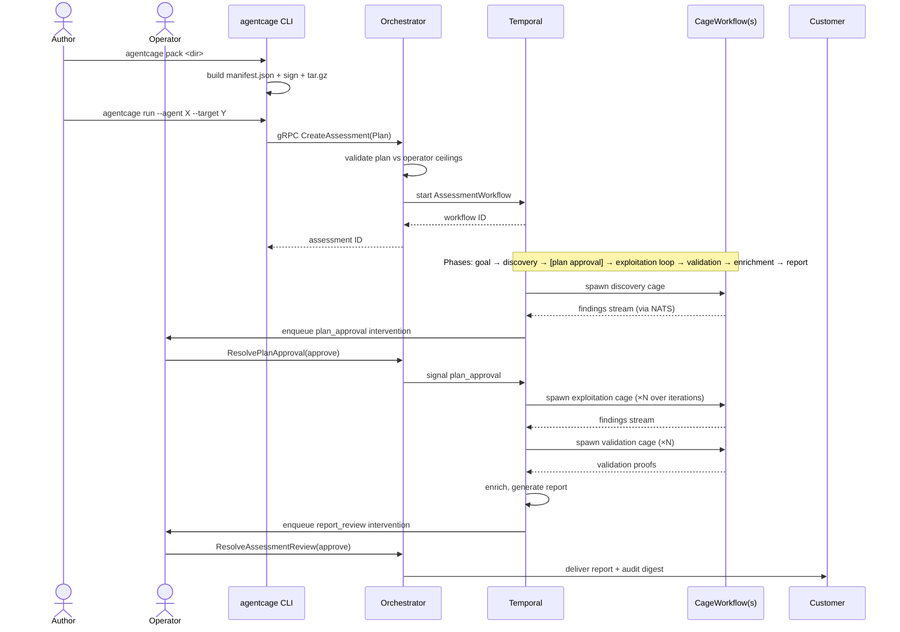
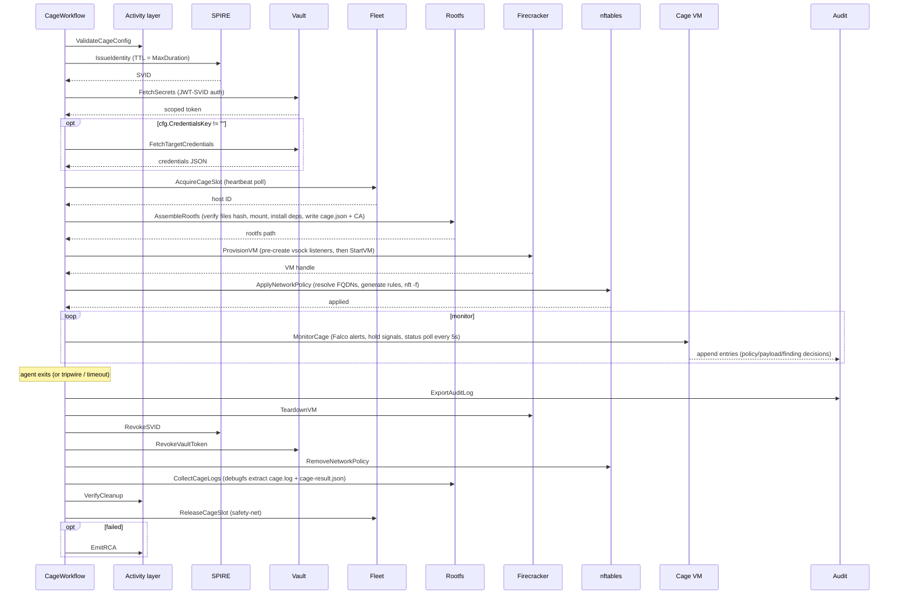
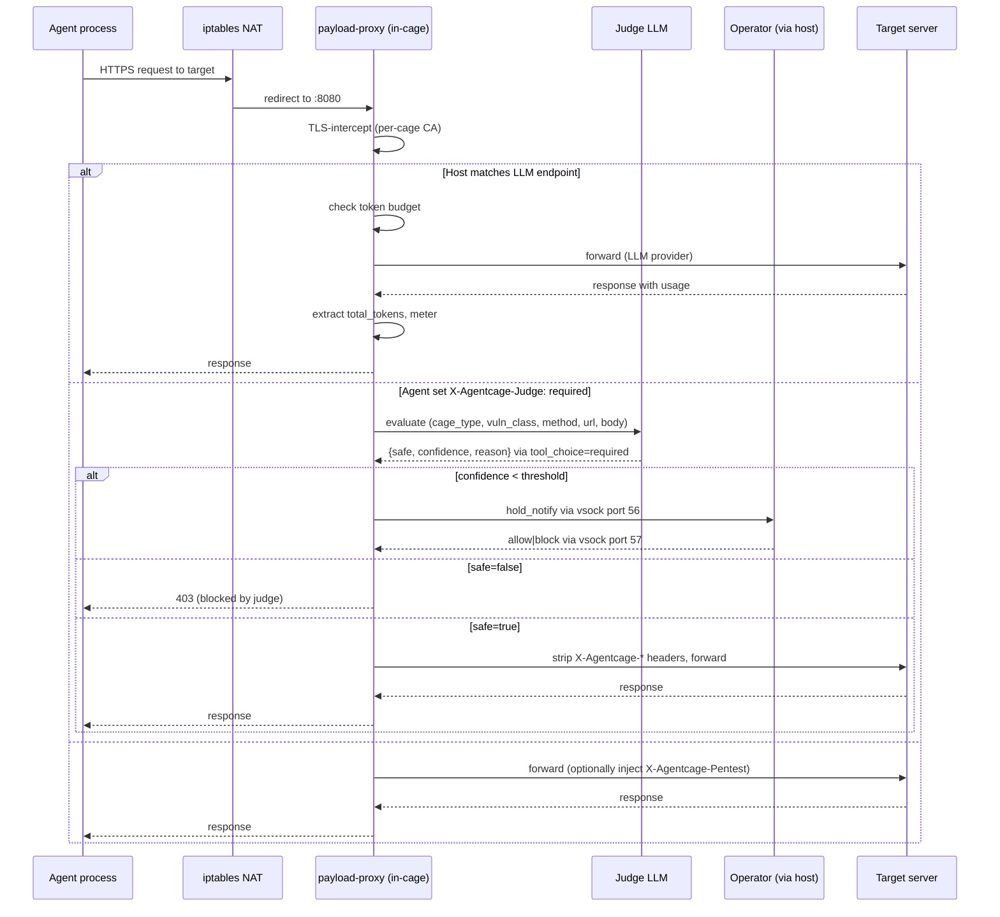
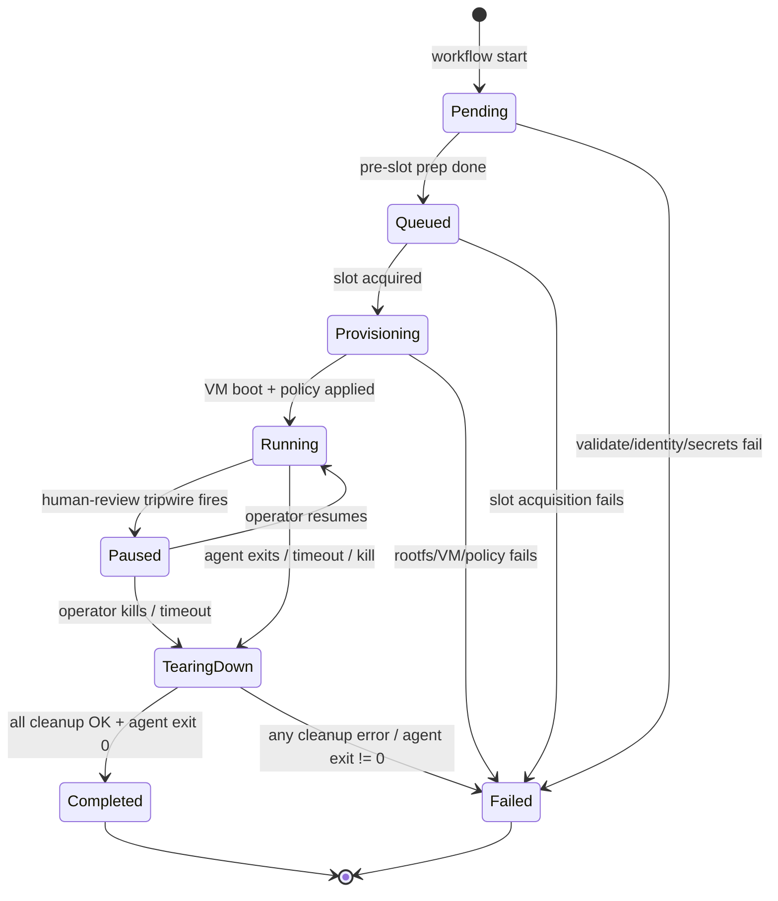
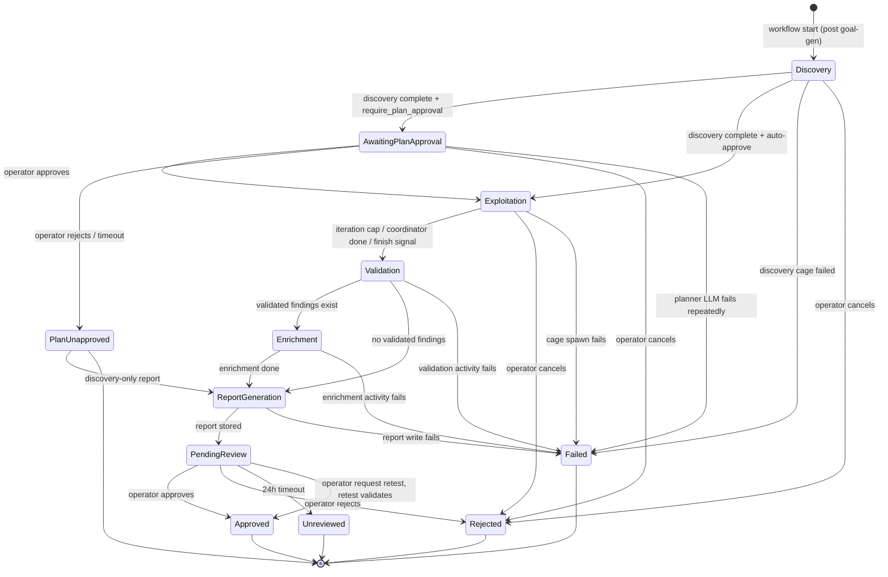
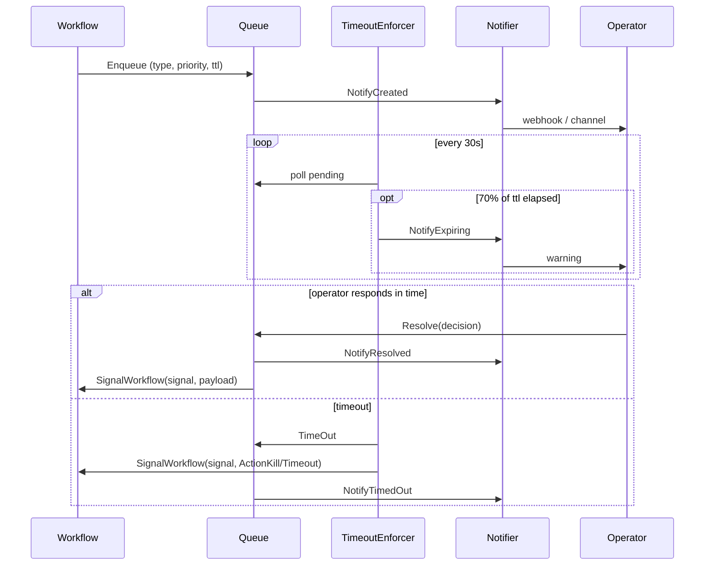
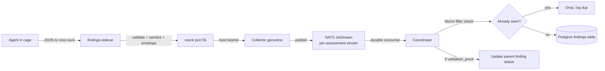
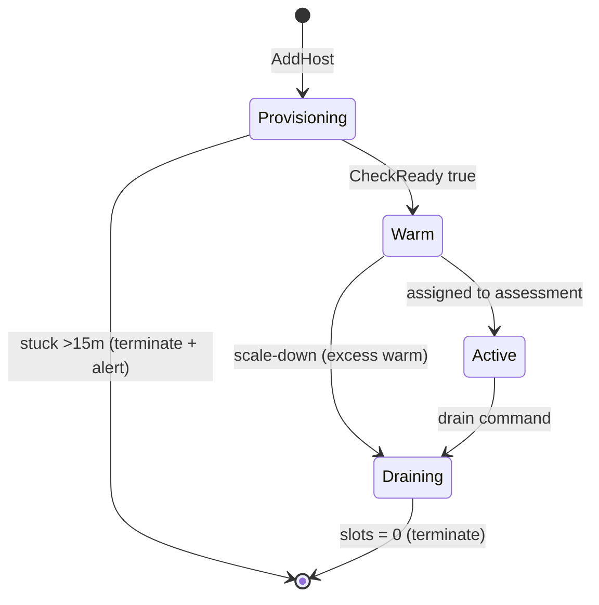
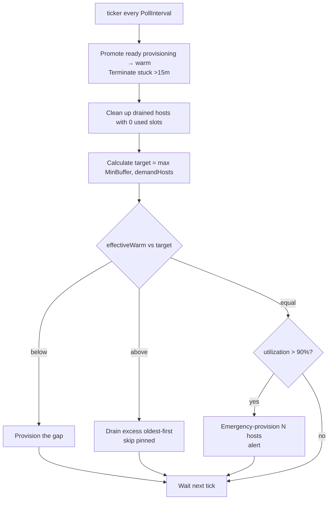

# agentcage architecture

This document walks the system top to bottom: what the pieces are, how they fit together, why each decision was made, and where the design has gaps. It is the long-form technical companion to the README. If you want the 60-second pitch, read the README. If you want to understand how a customer request becomes a delivered report and an HMAC-chained audit log a customer can verify offline, read this.

---

## System at a glance

| | |
|---|---|
| **Workload** | Customer-supplied autonomous exploit agents, packaged as signed `.cage` bundles via a `Cagefile` manifest. |
| **Isolation** | One Firecracker microVM per agent run, called a **cage**. Hardware virtualization, custom 6.1.155 kernel, no shared surface between runs. |
| **Trust model** | The agent inside the cage is hostile-by-construction. Containment is enforced by Firecracker, per-cage nftables, the payload proxy, Falco, and SPIFFE-scoped identity. No layer is trusted alone. |
| **Identity** | SPIFFE X.509 SVID per cage with TTL bounded by run duration; JWT-SVID exchange for downstream Vault auth. |
| **Secrets** | HashiCorp Vault. Cage tokens scoped to the cage's policy, auto-revoked at teardown. |
| **Egress** | Per-cage nftables on the cage TAP device, DNS resolver that returns NXDOMAIN for anything off the allowlist, TLS-intercepting payload proxy with optional judge LLM gating. |
| **Audit** | HMAC-SHA256 chain per cage with per-version keys. Customer-verifiable offline without orchestrator access. |
| **Workflow engine** | Temporal. Every cage activity has an explicit `StartToCloseTimeout`, idempotent retries, deterministic replay. |
| **Event bus** | NATS JetStream, per-assessment streams, durable consumers with `MaxDeliver: 3` and dead-letter. |
| **State** | PostgreSQL 16 with TimescaleDB hypertables for time-series. |
| **Runtime monitoring** | Falco syscall rules per cage. Tripwire alerts escalate to operator interventions. |
| **Control plane** | gRPC with mTLS (SPIRE) or sha256-hashed API keys, constant-time compared. |
| **Host requirements** | Orchestrator: Linux with `/dev/kvm`. `agentcage init` hard-rejects on macOS and Windows. CLI commands (`pack`, `run`, `connect`, `assessments`, `findings`, `audit verify`, ...) are cross-platform: any OS that runs a Go binary, talking to a remote Linux orchestrator over gRPC. |
| **Deployment** | Single static binary. All dependencies (Postgres, NATS, Temporal, SPIRE, Vault, Falco, Firecracker) embedded by default; any one externalizable via config. AWS AMI (Packer) and Terraform modules included. |

### Topology



Solid arrows are control flow (request, spawn). Dashed arrows are dependency calls (state writes, secret reads, identity exchange). Hollow arrows are VM-level provisioning.

---

## Table of contents

1. [What the system does](#1-what-the-system-does)
2. [Mental model and trust boundaries](#2-mental-model-and-trust-boundaries)
3. [Reader paths](#3-reader-paths)
4. [The Cagefile contract](#4-the-cagefile-contract)
5. [End-to-end lifecycle](#5-end-to-end-lifecycle)
6. [The orchestrator](#6-the-orchestrator)
7. [The cage subsystem](#7-the-cage-subsystem)
8. [The assessment layer](#8-the-assessment-layer)
9. [Security primitives](#9-security-primitives)
10. [Fleet](#10-fleet)
11. [Operational concerns](#11-operational-concerns)
12. [Failure modes](#12-failure-modes)
13. [Known limitations and open work](#13-known-limitations-and-open-work)
14. [Appendix: proto services, DB schema, dev quickstart](#14-appendix)

---

## 1. What the system does

agentcage is an **infrastructure platform for running custom autonomous agents** against authorized targets. The author writes the agent (any language, any tooling, any model) alongside a **Cagefile**: a short text manifest in the spirit of a Dockerfile, declaring runtime, entrypoint, pinned dependencies, and which assessment phases the agent participates in (discovery, exploitation, validation). `agentcage pack` produces a signed `.cage` bundle; `agentcage run` ships it to the orchestrator. The orchestrator owns everything the fact-sheet above lists: isolation, identity, secrets, egress, audit, workflow, findings, fleet. The agent runs; the platform makes sure it runs *safely*, *visibly*, and *verifiably*.

**Out of scope.** agentcage is not a vulnerability scanner: it ships no rules, no signatures, no detectors. It is not an agent framework: agent intelligence (prompting, model selection, exploit reasoning, multi-model patterns) lives in the customer-supplied bundle, not here. It is not a hosted SaaS: the orchestrator is a binary that operators run themselves, on hardware they control. It is not a model-training rig: every LLM call is metered and forwarded to an external provider. The platform is the control plane the agent runs *under*; the agent is the workload.

---

## 2. Mental model and trust boundaries

Three layers across two trust boundaries: the **customer↔orchestrator** boundary (slow, human-driven, validated twice), and the **orchestrator↔cage** boundary (Firecracker, everything below it hostile). The topology diagram in [System at a glance](#system-at-a-glance) shows the full set of components and dependencies; this section names what crosses each boundary and what enforces it.

| Boundary | What crosses it | Enforcement |
|---|---|---|
| **Customer ↔ Orchestrator** | gRPC RPCs (CreateAssessment, GetFindings, ResolveIntervention, etc.) | mTLS via SPIRE workload API, or sha256-hashed API keys constant-time-compared. Plan validated against operator-policy ceilings before persistence. |
| **Orchestrator ↔ Cage (host→guest)** | Directives (resume/redirect/terminate), hold release decisions | Vsock with CONNECT protocol on Firecracker UDS. Atomic file write in guest with monotonic sequence. |
| **Cage ↔ Orchestrator (guest→host)** | Findings, log lines, agent holds, payload-proxy control messages, token usage | Vsock listener pre-created host-side before VM boot. Validation + sanitization on receipt. |
| **Cage ↔ Target** | HTTP/HTTPS requests | nftables rules on TAP device (allowlist-only). DNS resolver allows only target + LLM + NATS. Payload proxy intercepts TLS, meters LLM, gates through judge. |
| **Orchestrator ↔ Vault** | Secret reads/writes | JWT-SVID from SPIRE in production. Tokens refreshed 60s before expiry. |
| **Orchestrator ↔ SPIRE** | SVID issuance/verification | Workload API over Unix socket. |
| **Orchestrator ↔ NATS** | Findings publish/subscribe | JetStream with at-least-once delivery, MaxDeliver: 3, dead-letter. |
| **Orchestrator ↔ Postgres** | State persistence | Connection string from Vault. |

The orchestrator is the trusted kernel. It validates configs, issues identities, enforces policy, signs audit entries, and decides what cages get to exist. If the orchestrator is wrong, nothing else matters.

Everything inside a cage is hostile. Assume the agent will try to break out, exfiltrate data, attack systems it was not authorized to touch, or burn a token budget that bills the customer. Containment is enforced by Firecracker isolation, nftables egress policy, the payload proxy, Falco runtime monitoring, and a SPIFFE-scoped identity with a Vault token that only the orchestrator can mint. No single layer is sufficient; each one assumes the others might fail.

The platform depends on Vault, SPIRE, Temporal, NATS, Postgres, and Falco. Each one ships **embedded by default**: `agentcage init` downloads the binary, supervises the process, and tears it down on shutdown, so a fresh install needs no external infrastructure. Operators who already run these services (or who prefer to manage them under their own ops practice) can point at external instances via config (`infrastructure.postgres.external: true`, `infrastructure.temporal.address: <addr>`, etc.). The full embedded-vs-external matrix is in [§6 Embedded vs external services](#embedded-vs-external-services). Embedded or external, the dependencies sit on the same partially-trusted footing: they get health-checked at startup, they get bounded teardown deadlines, every connection has a tear-down path, and a wedged dependency is not allowed to cascade into a wedged orchestrator. See [§12 Failure modes](#12-failure-modes) for the specifics.

---

## 3. Reader paths

This document is long. Pick the path that matches what you want to know:

| You are... | Read |
|---|---|
| **An agent author** wanting to ship something on the platform | [§4 Cagefile contract](#4-the-cagefile-contract), [§5 Lifecycle](#5-end-to-end-lifecycle), [§14 Appendix dev quickstart](#14-appendix) |
| **An infra engineer** evaluating the design | [§5 Lifecycle](#5-end-to-end-lifecycle), [§6 Orchestrator](#6-the-orchestrator), [§7 Cage subsystem](#7-the-cage-subsystem), [§13 Known limitations](#13-known-limitations-and-open-work) |
| **A security reviewer** checking the trust model | [§2 Trust boundaries](#2-mental-model-and-trust-boundaries), [§9 Security primitives](#9-security-primitives), [§12 Failure modes](#12-failure-modes), [§13 Known limitations](#13-known-limitations-and-open-work) |
| **An operator** running this in production | [§6 Orchestrator](#6-the-orchestrator), [§10 Fleet](#10-fleet), [§11 Operational concerns](#11-operational-concerns), [§12 Failure modes](#12-failure-modes) |
| **Debugging a specific cage failure** | [§7 Cage subsystem](#7-the-cage-subsystem), [§11 Operational concerns](#11-operational-concerns), [§12 Failure modes](#12-failure-modes) |
| **Looking up an interface** | [§14 Appendix proto services / DB schema](#14-appendix) |

---

## 4. The Cagefile contract

This is the design protagonist. Everything in §7 (the cage subsystem) is downstream of this design decision.

### What an agent author writes

The author writes a **Cagefile** at the root of their agent directory. Looks like this:

```
# my-pentest-agent/Cagefile
RUNTIME python3
ENTRYPOINT python3 -m agent

DEPS curl jq sqlmap
PIP requests==2.31.0
PIP openai==1.20.0

ENV LOG_LEVEL=info

DISCOVERY
EXPLOITATION http_probe sql_injection xss_probe idor_probe
VALIDATION
```

Directives are conventionally uppercase (matching Dockerfile style); the parser is case-insensitive so lowercase also works.

Directive reference:

| Directive | Value | Purpose |
|---|---|---|
| `RUNTIME` | `python3` \| `node` \| `go` \| `static` | Selects the base rootfs interpreter. |
| `ENTRYPOINT` | command line | What `cage-init` execs after startup. |
| `BUILD` | command line (optional) | Run at pack time after dependency install. |
| `DEPS` | space-separated tool names | Pre-installed offensive tools from the base rootfs (sqlmap, nmap, curl, jq, etc.). Not network-installed at cage boot. |
| `PACKAGES` | pinned apk specs (`name=version-rN`) | Extra alpine packages installed via apk in chroot at rootfs assembly. |
| `PIP` | pinned pip specs (`name==version`) | Python deps installed at pack time into the bundle. |
| `NPM` | pinned npm specs (`name@version`) | Node deps. No semver ranges allowed. |
| `GO-DEPS` | pinned go install targets (`module@v1.2.3`) | Go binaries built at pack time. |
| `ENV` | `KEY=VALUE` | Author-supplied env vars (the `AGENTCAGE_` prefix is reserved). |
| `DISCOVERY` | (no value) | Agent participates in the discovery phase. |
| `EXPLOITATION` | space-separated tool names | List of tools the LLM coordinator reads as a "resume" when deciding what to spawn the agent for. |
| `VALIDATION` | (no value) | Agent participates in the validation phase. |

### How pack turns it into a bundle

`agentcage pack <dir>` produces a gzip-tar `.cage` file with three top-level entries:

```
my-pentest-agent.cage   (gzip-tar)
├── manifest.json       ← bundle manifest (read by the orchestrator)
├── signature.json      ← sha256 hash + optional Ed25519 signature
└── files/              ← the agent's source tree
    ├── agent/
    ├── requirements.txt
    └── ...
```

The manifest:

```json
{
  "name": "my-pentest-agent",
  "tag": "v1.0.0",
  "packed_with": "0.4.1",
  "runtime": "python3",
  "entrypoint": "python3 -m agent",
  "system_deps": ["curl", "jq", "sqlmap"],
  "pip_deps": ["requests==2.31.0", "openai==1.20.0"],
  "env": {"LOG_LEVEL": "info"},
  "capabilities": {
    "discovery": true,
    "exploitation": ["http_probe", "sql_injection", "xss_probe", "idor_probe"],
    "validation": true
  },
  "files_hash": "sha256:9c2f8b1a4d7e..."
}
```

The signature:

```json
{
  "manifest_hash": "sha256:af3b2c1d8e7f...",
  "ed25519_sig":   "deadbeefcafe...",
  "public_key":    "-----BEGIN PUBLIC KEY-----\n...\n-----END PUBLIC KEY-----\n"
}
```

`manifest_hash` is SHA-256 of the raw `manifest.json` bytes. `ed25519_sig` (when an operator signing key is configured) signs the same bytes. On unpack, the hash is verified **before any chroot install runs**, so a tampered manifest (an injected pip dep, say) is rejected before it can cause damage. When `UnpackOptions.VerifyKey` is provided, the Ed25519 signature is required and must verify against that key. The rootfs assembler ([internal/cage/rootfs.go:88-105](internal/cage/rootfs.go#L88-L105)) re-verifies `files_hash` against the unpacked `files/` tree before chrooting and executing install hooks at host privilege.

### What the platform guarantees in return

When the orchestrator receives a `.cage` bundle and runs it, the agent gets:

| Resource | Guarantee |
|---|---|
| Compute | A unique Firecracker microVM per cage. Hardware isolation, custom kernel. |
| Identity | A SPIFFE X.509 SVID with TTL equal to the cage's `MaxDuration`. Auto-expires. |
| Secrets | A Vault token scoped to the cage's policy. Auto-revoked at teardown. |
| Target creds | Optionally, JSON read from `secret/data/agentcage/target/<key>` and exposed as `AGENTCAGE_TARGET_CREDENTIALS`. Never appears in logs or gRPC payloads. |
| Network | nftables egress policy pinned to the cage's TAP device, per-(CIDR, port) allowlist. |
| DNS | A controlled resolver that answers only for the target, the LLM endpoint, and NATS. NXDOMAIN otherwise. |
| HTTP/HTTPS | All TCP 80/443 (and a non-standard LLM port if set) routed through the payload proxy via iptables. Per-cage CA for TLS interception. |
| LLM | Token metering, per-cage budget enforcement, optional judge gating. |
| Findings | Unix socket → vsock → NATS JetStream → orchestrator. At-least-once delivery. |
| Operator gate | Per-request judge holds, agent-initiated holds, Falco tripwire escalations. All go through the intervention queue. |
| Audit | HMAC-SHA256 chain rooted at cage ID, with key version on every entry. |
| Telemetry | OpenTelemetry instruments wired through metrics package. |
| Logs | Persistent `/var/log/cage.log` with fsync per line. Survives VM death. |
| Exit code | Written to `/var/log/cage-result.json`. Extracted via debugfs post-mortem. |

The author writes one signed bundle. The platform owns everything else.

### Pack-time validations

Two classes of bundle validation run before any cage is provisioned, so an operator sees a clear error at pack time rather than an opaque chroot install failure later.

**Dependency pinning.** [internal/cagefile/parse.go:215-289](internal/cagefile/parse.go#L215-L289) rejects unpinned specs. The rootfs builder runs `apk add`, `pip install`, and equivalents in chroot with orchestrator network access, so an unpinned spec is a typosquat / dependency-confusion vector.

| Manager | Required form |
|---|---|
| apk | `name=version-rN` |
| pip | `name==version` or `name @ url#sha256=...` |
| npm | `name@version` (no `^~><*` ranges) |
| go | `module@v1.2.3` with leading `v` |

**Package denylist.** [internal/cagefile/bundle.go:357-373](internal/cagefile/bundle.go#L357-L373) blocks 13 packages whose presence would defeat containment.

| Category | Packages |
|---|---|
| Container runtimes | docker, docker.io, containerd, podman, lxc |
| Firewall manipulation | iptables, nftables |
| Raw packet capture | tcpdump, wireshark, tshark |
| Raw sockets | socat |
| VPN tunnels | openvpn, wireguard |
| Kernel access | kmod, linux-headers |

Each would give the agent capabilities the cage's containment model does not anticipate.

### Why this contract matters

The Cagefile is the only thing the agent author writes that the platform reads. Authors don't touch trust-boundary code and therefore cannot accidentally weaken it. Operators can sign off on a bundle once and the signature flows through every audit entry. Capability declarations let the orchestrator decide what workflow to run (discovery cage vs exploitation cage vs validation cage) without parsing agent source. This is the developer-experience claim of the entire system: `pack`, `run`, ship code, get findings.

---

## 5. End-to-end lifecycle

The full flow from `agentcage pack` to a signed audit digest. Two views: top-level sequence, then per-cage zoom.

### Top-level: pack → run → report



### Per-cage zoom: what one CageWorkflow does



### A single request leaving the cage

What happens when the agent makes an HTTP call:



### Audit chain append (every decision)

Every state transition, policy decision, identity issuance, egress allow/block, payload allow/block/hold, finding emit/validate/reject, tripwire, intervention, identity issue/revoke, secret fetch/revoke, and LLM request/response writes an `audit.Entry`. The chain is per-cage:

```
┌────────────────────────────────────────────┐
│ Entry 1                                    │
│  sequence: 1                               │
│  type:     cage_provisioned                │
│  data:     {...}                           │
│  prev_hash:000...0                         │
│  key_ver:  v3                              │
│  signature:HMAC-SHA256(key_v3, canonical)  │
└──────────────┬─────────────────────────────┘
               │ SHA256(signature)
               ▼
┌────────────────────────────────────────────┐
│ Entry 2                                    │
│  sequence: 2                               │
│  type:     identity_issued                 │
│  data:     {svid_id, spiffe_id, ttl}       │
│  prev_hash:H(sig of Entry 1) ← chain link  │
│  key_ver:  v3                              │
│  signature:HMAC-SHA256(key_v3, canonical)  │
└──────────────┬─────────────────────────────┘
               │ SHA256(signature)
               ▼
            ...

At teardown:
┌────────────────────────────────────────────┐
│ Digest                                     │
│  cage_id:        cage_4e7f2a8b91           │
│  assessment_id:  asmt_1d8c3b5e7f           │
│  chain_head_hash:H(sig of last entry)      │
│  entry_count:    142                       │
│  key_version:    v3                        │
│  signature:      HMAC-SHA256(...)          │
│  issued_at:      2026-05-23T18:31:42Z      │
└────────────────────────────────────────────┘
```

The customer downloads the digest at delivery. If anyone later tampers with the chain entries (delete, reorder, modify), `VerifyChainLinkage` fails without needing Vault access: sequence continuity and the `prev_hash` chain are self-validating. Full signature verification needs a `KeyResolver` to look up `key_version`.

---

## 6. The orchestrator

### Deployment topology

```
Single machine (laptop / single host):
  ┌───────────────────────────────────────────────────────┐
  │  agentcage init                                       │
  │  ├─ orchestrator                                      │
  │  ├─ embedded postgres   (127.0.0.1:5432)              │
  │  ├─ embedded NATS       (127.0.0.1:4222)              │
  │  ├─ embedded Temporal   (127.0.0.1:7233)              │
  │  ├─ embedded SPIRE      (127.0.0.1:8081, unix sock)   │
  │  ├─ embedded Vault      (127.0.0.1:8200, dev token)   │
  │  ├─ embedded Falco                                    │
  │  ├─ Firecracker binary                                │
  │  └─ Cages run on the same host                        │
  └───────────────────────────────────────────────────────┘

Multi-machine:
  ┌──────────────────────────┐    ┌────────────────────────┐
  │  Orchestrator host       │    │  Cage host(s)          │
  │  ├─ orchestrator         │◄──►│  ├─ host-init          │
  │  ├─ Postgres (external)  │    │  ├─ Firecracker        │
  │  ├─ NATS    (external)   │    │  ├─ Falco              │
  │  ├─ Temporal(external)   │    │  └─ Cages              │
  │  ├─ SPIRE server         │    │                        │
  │  └─ Vault                │    │  (joins via            │
  │                          │    │   agentcage join ...)  │
  │  Bound on 0.0.0.0 when   │    └────────────────────────┘
  │  advertise_address set   │
  └──────────────────────────┘
```

`infrastructure.advertise_address` set in config triggers multi-machine mode: embedded services bind to `0.0.0.0` instead of `127.0.0.1`, and the orchestrator's `GetServiceEndpoints` RPC returns reachable addresses for `host-init` to discover SPIRE and Nomad without manual config.

### Deployment images (AMI via Packer)

For cloud deployments, [infra/packer/agentcage.pkr.hcl](infra/packer/agentcage.pkr.hcl) bakes a ready-to-boot AWS AMI on top of Ubuntu Noble 24.04 LTS. The provision script ([infra/packer/provision.sh](infra/packer/provision.sh)) installs:

| Layer | Source / Notes |
|---|---|
| Base OS | Ubuntu 24.04 LTS (Canonical-owned, most recent). |
| PostgreSQL 16 + TimescaleDB | PGDG apt repo (`apt.postgresql.org`). Ubuntu's archive lags upstream by quarters and TimescaleDB tracks the latest patch, so the distro repo can't satisfy current TS packages. |
| Runtime deps | nodejs, npm, python3, golang-go, bash, iptables, iproute2, e2fsprogs. |
| `agentcage` binary | Downloaded from GitHub release (`v${AGENTCAGE_VERSION}`) into `/usr/local/bin/agentcage`. |
| Systemd unit | `agentcage.service`: `ExecStart=agentcage init`, `ExecStop=agentcage stop`, `TimeoutStopSec=120`, `Restart=on-failure`. |

The system PostgreSQL service is **disabled** post-install; agentcage manages its own embedded Postgres via `embedded.Manager`. Same logic applies for any system service that would collide with what agentcage runs.

Build:

```bash
cd infra/packer
packer init .
packer build -var "agentcage_version=0.4.1" .
```

Currently x86_64 only (no arm64 AMI yet). The Terraform modules under [infra/terraform/](infra/terraform/) consume the resulting AMI ID for the orchestrator EC2 instance, with separate `bootstrap/` (network, IAM, S3 state) and `deploy/` (EC2, EIP, security groups) stacks.

### Entrypoint discipline

[cmd/agentcage/main.go](cmd/agentcage/main.go) is a thin dispatcher. The interesting subcommand is `init`. [cmd/agentcage/cmd_init.go](cmd/agentcage/cmd_init.go) is the canonical example of the project's startup discipline. The sequence matters:

1. Write/load config. Falco rules go to disk **before** the daemon starts ([cmd_init.go:101-105](cmd/agentcage/cmd_init.go#L101-L105)) because otherwise Falco misses the first batch of cage events.
2. Download and start embedded services via `embedded.Manager`. Each service starts in dependency order; if any one fails health-check, previously-started services are stopped in reverse order.
3. **Identity and secrets resolve before database and NATS** ([cmd_init.go:130-135](cmd/agentcage/cmd_init.go#L130-L135)). External service URLs (with embedded credentials) live in Vault.
4. Build cage runtime, LLM gateway, intervention queue, findings bus, fleet pool.
5. Construct `cage.ActivityImpl` and `assessment.ActivityImpl`: single structs holding every I/O dependency the Temporal activities need.
6. **Start Temporal workers before gRPC accepts traffic.** A readiness probe closes the race ([cmd_init.go:344-347](cmd/agentcage/cmd_init.go#L344-L347)); without it, an assessment created in the first millisecond of uptime would find no worker polling its task queue.
7. Start the intervention timeout enforcer. If it dies, the parent context is cancelled so the operator notices.
8. Write PID file and serve gRPC. If PID file write fails, refuse to start rather than start unstoppable.

Shutdown bounded deadlines:

| Phase | Deadline | What |
|---|---|---|
| gRPC graceful stop | 15s | Wait for in-flight RPCs to finish. |
| Worker drain | 30s (parallel) | Cage worker + assessment worker stop polling, finish in-flight activities. |
| Embedded service stop | 30s | Reverse start order, SIGINT then SIGKILL. |
| Hard kill | 90s overall | If anything hangs past this, `os.Exit`. |

A shutdown that can hang is a shutdown that will hang.

### Embedded vs external services

| Service | Embedded by default | Config flag to externalize | Purpose |
|---|---|---|---|
| Postgres | yes | `infrastructure.postgres.external: true` | Persistent state (cages, assessments, findings, audit, fleet, interventions, SLO). |
| NATS | yes | `infrastructure.nats.external: true` | Findings JetStream, cage log fan-out, OTel option. |
| Temporal | yes | `infrastructure.temporal.address: <addr>` | Workflow engine for cage and assessment lifecycles. |
| SPIRE | yes | `infrastructure.spire.agent_socket: <path>` | Per-cage X.509 + JWT SVIDs. |
| Vault | yes (dev token) | `infrastructure.vault.address: <addr>` | Secret storage + audit signing keys. |
| Falco | yes | (no external mode) | Syscall-level runtime monitoring. |
| Nomad | optional | `infrastructure.nomad.address: <addr>` | Multi-host VM scheduling. |
| Firecracker | yes (binary download) | `cage_runtime.firecracker_bin: <path>` | VM hypervisor. |
| cage-internal binaries | yes (built into bin/) | (not externalizable) | cage-init, payload-proxy, directive-sidecar, findings-sidecar. |

Manager logic: every service implements `Service` interface (`Name`, `Download`, `Start`, `Stop`, `Health`, `IsExternal`). External-flagged services are skipped entirely. Downloads run concurrently via errgroup. Starts run sequentially with 15s health check between each.

### Why these dependencies

Each load-bearing dependency was chosen against real alternatives. The short version of the rationale for each:

| Component | Chosen | Alternatives considered | Why this one |
|---|---|---|---|
| **Isolation** | Firecracker microVM | Docker / OCI containers (shared kernel; agent breakout is one CVE away), gVisor (user-space syscall filter; has had multiple escape CVEs and is slow for the syscall-heavy workload offensive tools generate), Kata Containers (heavier boot, more device surface), bare KVM/QEMU (much larger attack surface, slower boot) | Hardware virt with a minimal device surface (no USB, no PCI passthrough, no graphics), sub-second cold boot, mature ops story from AWS Lambda and Fly.io running it at scale. Custom kernel makes the syscall surface the platform's, not the distro's. |
| **Identity** | SPIRE (SPIFFE) | Internal CA + manual rotation, Vault PKI alone, cert-manager (k8s-centric, no attestation), cloud-IAM-only | SPIFFE is the only model that combines *attestation* (the workload proves what it is to the issuer via the workload API) with X.509 and JWT SVID issuance. A homegrown CA can mint certs but cannot prove which workload is asking. Per-cage SVIDs with TTL-bounded validity drop neatly into the cage lifecycle. |
| **Secrets** | HashiCorp Vault | AWS Secrets Manager / GCP Secret Manager (cloud-locked, defeats portable deploy), file-mounted secrets (no per-cage scoping, no audit), in-process encrypted store (no operator escape hatch, no rotation story) | Identity-bound auth via JWT-SVID composes with SPIRE; per-cage tokens with auto-revoke at teardown solve the credential-lifetime problem; KV+PKI+transit in one binary keeps the dependency count down; operator-familiar surface. |
| **Workflow engine** | Temporal | Custom orchestrator (loses crash safety, replay, signals), Kubernetes Jobs (no mid-execution state, no first-class signals), Argo Workflows (k8s-only), Airflow (batch-oriented, weak signal/query primitives) | Durable execution survives orchestrator restart mid-cage with no manual reconciliation; deterministic replay forces the workflow code into a shape that's also good for review and testing; signal/query primitives map directly to the intervention pattern; idempotent activity retries match cage spawn semantics. |
| **Event bus** | NATS JetStream | Kafka (operational weight, ZooKeeper/KRaft, partition planning per stream), RabbitMQ (no equivalent of cheap per-stream durability), Redis Streams (less durable, no cluster-mode replication for streams), in-process channels (lost on orchestrator restart) | Single static binary, cheap stream-per-assessment creation, durable consumers with `MaxDeliver`/dead-letter semantics that map directly to the findings retry model. Embedded by default keeps the laptop story simple. |
| **Runtime monitoring** | Falco | Custom eBPF programs (correct but high rule-maintenance burden), auditd (worse perf, harder rule expression), bcc/bpftrace ad-hoc (no rule library) | CNCF rule library already covers most of the tripwire categories (privilege escalation, raw socket, container escape, kernel module load) without writing eBPF; outputs a tail-able JSON stream the orchestrator can subscribe to without a custom collector. |
| **State** | PostgreSQL 16 + TimescaleDB | MySQL (weaker JSON, weaker constraints), CockroachDB (too heavy for single-host default), SQLite (single-writer, no concurrent worker fanout), separate TSDB like Prometheus for time-series (second datastore to operate) | Postgres is the universal operator-understood baseline; TimescaleDB extension gives hypertables + compression for SLO metrics, demand history, and capacity snapshots without a second datastore. |
| **Fleet scheduling** | In-tree autoscaler (optional Nomad) | Kubernetes (forces the whole platform onto k8s, conflates cage isolation with pod isolation), bare orchestrator-decides-everything (no pluggable cloud provisioner) | The autoscaler is intentionally small and pluggable via the `Provisioner` interface; operators who want Nomad get a real scheduler, operators who want a static fleet get a `LocalProvisioner`, cloud users wire a webhook to Terraform/CloudFormation. Avoiding k8s as a hard dependency was a deliberate cost-of-ownership decision. |
| **Hypervisor host** | Linux + `/dev/kvm` | macOS Apple VZ (dev-only, no production parity), Windows Hyper-V (no Firecracker support), nested virt under another hypervisor (perf cliff, vendor lock) | Production-class Firecracker only runs on Linux with KVM. macOS Apple VZ on M3+ is supported for *development* (nested virt is fast enough for an iteration loop), not for production. |

The pattern: pick the smallest mature dependency that solves a load-bearing problem; reject anything that ties the platform to a single cloud or that forces operators onto Kubernetes; keep a working embedded default so a fresh laptop install needs no external infrastructure.

### Configuration: posture

The most important knob. [internal/config/config.go](internal/config/config.go) defines `Posture`:

| Setting | Strict (default) | Dev |
|---|---|---|
| gRPC reflection | off | on |
| No-TLS global bind | refused | allowed |
| LLM endpoint missing | fatal | warn-and-continue |
| Scope: localhost target | denied | allowed |
| Scope: wildcard hostname | denied | allowed |
| Scope: private CIDRs | denied (unless DNS off) | allowed |
| OTel insecure | forbidden | allowed |
| Plaintext HTTP webhook | refused | allowed |

**Firecracker isolation is always required** regardless of posture. There is no unisolated fallback path; the trust model is the product.

Posture-aware accessors (`GRPCReflectionDefault`, `ScopeDenyLocalhostDefault`, `ScopeDenyWildcardsDefault`, `OTelInsecureDefault`, `LLMRequiredDefault`) keep the strict-vs-dev decision encapsulated. A new fail-closed gate gets a posture-aware accessor in the same commit it is introduced.

### Activity timeouts

[internal/cage/timeouts.go](internal/cage/timeouts.go) reads these from `config.ActivityTimeoutsConfig`. Every cage activity has an explicit `StartToCloseTimeout`. Long-running ones add `HeartbeatTimeout` and heartbeat at less than one-third of it. All wrapped in 3-attempt retry policies.

| Activity | StartToClose | Heartbeat | Notes |
|---|---|---|---|
| `ValidateCageConfig` | 30s | n/a | Pre-compiled denylist + caps; fast. |
| `IssueIdentity` | 30s | n/a | One SPIRE workload API call. |
| `FetchSecrets` | 30s | n/a | One Vault JWT auth + token lookup. |
| `FetchTargetCredentials` | 30s | n/a | One Vault KV read. |
| `AcquireCageSlot` | 30m | 60s | Polls fleet until slot available; heartbeats so wedged poll surfaces. |
| `AssembleRootfs` | 30m | 60s | Copy base rootfs (multi-GB), mount, install deps in chroot. |
| `ProvisionVM` | 30m | 60s | Includes pre-create vsock listeners and Firecracker config. |
| `ApplyNetworkPolicy` | 60s | n/a | DNS resolve + nftables apply. |
| `MonitorCage` | `cfg.MaxDuration + 60s` | configurable (typ. 30s) | Long-running; heartbeats every 5s. |
| `SuspendAgent`/`ResumeAgent` | 30s | n/a | Firecracker PATCH /vm. |
| `WriteDirective` | 30s | n/a | Vsock CONNECT + payload + ACK. |
| `EnqueueIntervention` | 30s | n/a | One DB write + one notifier call. `MaximumAttempts: 1` (fail-closed). |
| `ExportAuditLog` | 5m | n/a | DB read + JSON write. |
| `TeardownVM` | 5m | n/a | Firecracker kill + UDS cleanup. |
| `RevokeSVID` | 30s | n/a | No-op today (natural expiry). |
| `RevokeVaultToken` | 30s | n/a | Idempotent (403 = already revoked). |
| `VerifyCleanup` | 60s | n/a | Stat check on vsock paths and TAP. |

### gRPC layer

Two TLS paths:

- **SPIRE mTLS** ([internal/grpc/tls.go](internal/grpc/tls.go)). production. `tlsconfig.MTLSServerConfig` from go-spiffe handles cert rotation via the workload API; only clients from the configured trust domain are accepted.
- **File TLS with hot reload** ([internal/grpc/reloadable_tls.go](internal/grpc/reloadable_tls.go)). `ReloadableCert` holds `atomic.Pointer[tls.Certificate]`; SIGHUP swaps the cert without dropping in-flight connections. Cipher suites locked to AEAD with forward secrecy.

Authentication ([internal/grpc/auth.go](internal/grpc/auth.go)): mTLS first, then API keys. Keys are SHA-256 hashed and constant-time compared. Keys are re-read from config on every request so newly created keys work immediately without restart. `Ping` and `Health` skip auth so `agentcage connect` works before the client has credentials.

Two interceptors on every call:
- `RecoveryUnaryInterceptor`: turns handler panics into `INTERNAL` errors with full stack logged; clients get a generic message so internals don't leak.
- `LoggingUnaryInterceptor`: records method, peer, duration, gRPC status code. Errors at error level; successful calls at V(1).

[internal/grpc/socket_activation.go](internal/grpc/socket_activation.go) implements systemd socket activation. When `LISTEN_PID` and `LISTEN_FDS` are set, the first inherited fd becomes the gRPC listener. Enables zero-downtime restart (new orchestrator inherits the socket without dropping connections) and privilege separation (systemd binds the privileged port, hands the fd to the unprivileged agentcage user). Env vars are cleared after use so subprocesses don't reuse them.

---

## 7. The cage subsystem

### Cage state machine



States are explicit so the operator-facing CLI never lies. `StatePending` should be brief (>5s indicates a worker problem). `StateQueued` can be long on a busy fleet. `StateProvisioning` is heavy work (~30s to a few minutes). The bulk of cage lifetime is `StateRunning`.

### The CageWorkflow activities

[internal/cage/workflow.go](internal/cage/workflow.go) defines `CageWorkflow`. Three decisions matter more than they look:

**1. `AcquireCageSlot` before `AssembleRootfs`** ([workflow.go:71-87](internal/cage/workflow.go#L71-L87)). Without this gate, N concurrent cage workflows on a one-slot host race to copy a multi-GB rootfs and trip activity timeouts. The slot acquisition heartbeats while polling; `ProvisionVM` reads the pre-assigned host from a `cageHosts` map; `TeardownVM` clears it in lockstep with `vmToCage`. A safety-net `ReleaseCageSlot` runs at the end as a no-op for the happy path; it catches the case where `TeardownVM` was skipped because `ProvisionVM` never returned a handle.

**2. Teardown runs every step regardless of individual failures.** ([workflow.go:179-224](internal/cage/workflow.go#L179-L224)). Each cleanup activity's error is appended to `teardownErrs` and surfaced as the final result. The comment is load-bearing: *"An orphaned VM running exploit code with valid credentials is the worst outcome."* A teardown that exits early on the first error orphans VMs and leaks Vault tokens.

**3. Workflow versioning uses descriptive change IDs.** `workflow.GetVersion(ctx, "add-human-review-pause", workflow.DefaultVersion, 1)`. Comments name the version a gate shipped in. Removing a gate is a breaking change for in-flight workflows.

### The in-VM process tree

```
PID 1: cage-init
├── findings-sidecar    (listens /var/run/agentcage/findings.sock → vsock 55)
├── directive-sidecar   (vsock 52 → /var/run/agentcage/directives.json,
│                        local /var/run/agentcage/hold.sock → vsock 53,
│                        /var/run/agentcage/logs.sock → vsock 54)
├── payload-proxy       (listens :8080, iptables redirects 80/443/LLM_PORT)
└── agent               (execs ${entrypoint}, stdout/stderr → log socket)
```

### Vsock port assignments

[internal/cage/directive.go:13-20](internal/cage/directive.go#L13-L20). One direction per port; reusing ports for both directions caused confusion early.

| Port | Direction | Purpose |
|---|---|---|
| 52 | host → guest | Directives (Continue / Redirect / Terminate / HoldResult). One connection per directive; ACK with single byte. |
| 53 | guest → host | Agent-initiated hold requests. Blocking; waits for operator decision. |
| 54 | guest → host | Log forwarding. Long-lived connection with reconnect-on-drop. |
| 55 | guest → host | Findings stream. Long-lived, JSON-delimited. |
| 56 | guest → host | Payload-proxy control: token usage updates + hold notifications. |
| 57 | host → guest | Hold release decisions (allow/block). One connection per release. |

### Base rootfs and custom kernel

Every cage boots the same kernel and starts from a copy of the same base rootfs. Both are built **once per release per architecture**, then downloaded by `embedded.Manager` at first run and re-used across every cage. The per-cage rootfs assembly described below this section copies the base image; it never modifies it in place.

**Custom Firecracker kernel** ([scripts/build-kernel.sh](scripts/build-kernel.sh) + [scripts/kconfig-patch.sh](scripts/kconfig-patch.sh)). Linux 6.1.155 from kernel.org, base config pulled from Firecracker's CI repo, patched to add the options agentcage needs:

| Category | Options enabled |
|---|---|
| Vsock (host↔guest control plane) | `CONFIG_VSOCKETS`, `CONFIG_VIRTIO_VSOCKETS`, `CONFIG_VIRTIO_VSOCKETS_COMMON` |
| Netfilter core | `CONFIG_NETFILTER`, `CONFIG_NF_CONNTRACK`, `CONFIG_NF_NAT`, `CONFIG_NF_TABLES` |
| nftables (host-side egress policy on TAP) | `CONFIG_NF_TABLES_INET`, `CONFIG_NF_TABLES_IPV4/IPV6`, `CONFIG_NFT_NAT`, `CONFIG_NFT_MASQ`, `CONFIG_NFT_REDIR`, `CONFIG_NFT_COMPAT` |
| iptables (cage-init's HTTP→proxy redirect) | `CONFIG_NETFILTER_XT_TARGET_REDIRECT`, `CONFIG_IP_NF_NAT`, `CONFIG_NETFILTER_XT_TARGET_MASQUERADE`, `CONFIG_NETFILTER_XT_MATCH_MARK` |

Every option is built-in (`=y`) because `CONFIG_MODULES` is off and Firecracker's boot args include `nomodule`. There is no module loader inside the cage to load missing options post-boot. The kconfig patcher verifies every required option survives `make olddefconfig` before the build proceeds; missing options fail the build with a list of what's missing instead of producing a broken kernel that fails at first cage boot.

Per-arch output:
- **x86_64**: uncompressed ELF `vmlinux` (Firecracker boots ELF directly, skipping the decompression stage).
- **arm64**: uncompressed boot `Image` (Firecracker's arm64 path expects this format).

**Base cage rootfs** ([scripts/build-cage-rootfs.sh](scripts/build-cage-rootfs.sh)). Alpine 3.19 minirootfs, populated via chroot:

```
2GB ext4 image (compresses to ~500MB after fstrim + gzip)
├── /sbin/init               ← custom shell wrapper:
│                              mounts /proc /sys /dev, execs cage-init
├── /usr/local/bin/
│   ├── cage-init            ← PID 1 supervisor
│   ├── payload-proxy
│   ├── findings-sidecar
│   ├── directive-sidecar
│   ├── nuclei, httpx, katana, subfinder, interactsh-client, ffuf
│   └── (ProjectDiscovery + ffuf pulled from GitHub releases at build time)
├── /usr/bin/
│   ├── python3, pip, node, npm, go, bash
│   └── chromium, curl, wget, jq, bind-tools, sqlmap,
│       iptables, iproute2
├── /opt/agent               ← empty; per-cage assembly populates this
├── /etc/agentcage           ← empty; populated with cage.json + per-cage CA
└── /var/run/agentcage       ← empty; runtime sockets land here
```

The init script that becomes PID 1 inside Firecracker:

```sh
#!/bin/sh
export PATH="/usr/local/bin:/usr/bin:/bin:/usr/local/sbin:/usr/sbin:/sbin"
mount -t proc proc /proc
mount -t sysfs sys /sys
mount -t devtmpfs dev /dev
mount -o remount,rw /
exec /usr/local/bin/cage-init
```

All four supported `RUNTIME` values (`python3`, `node`, `go`, `static`) are pre-installed so per-cage rootfs assembly doesn't fetch them at provision time. Same for the standard offensive-tool set declared in `cagefile.SupportedTools`. Pre-installing them keeps the per-cage assembly path bounded to "copy + write config", not "download tools over the network."

**Distribution**. Both kernel and rootfs are published as release assets on GitHub. `embedded.Manager` downloads them at first run into `~/.agentcage/vm/`, checks size and presence, and reuses across all subsequent cages. New release ships → operator runs `agentcage init` → manager notices missing artifacts → downloads new versions.

### Firecracker provisioning

[internal/cage/firecracker.go](internal/cage/firecracker.go) does the platform-level VM setup. Real config sent over the Firecracker API:

```json
// PUT /boot-source
{
  "kernel_image_path": "/var/lib/agentcage/vm/vmlinux",
  "boot_args": "console=ttyS0 earlycon=uart,io,0x3f8 reboot=k panic=1 i8042.noaux i8042.nomux i8042.dumbkbd nomodule ip=172.20.0.5::172.20.0.4:255.255.255.254::eth0:off"
}

// PUT /drives/rootfs
{
  "drive_id": "rootfs",
  "path_on_host": "/var/lib/agentcage/rootfs/cage_4e7f2a8b91.ext4",
  "is_root_device": true,
  "is_read_only": false,
  "cache_type": "Writeback"
}

// PUT /machine-config
{
  "vcpu_count": 1,
  "mem_size_mib": 512
}

// PUT /network-interfaces/eth0
{
  "iface_id": "eth0",
  "host_dev_name": "tap-4e7f2a8b",
  "guest_mac": "02:34:65:37:66:37"
}

// PUT /vsock
{
  "guest_cid": 3,
  "uds_path": "/tmp/firecracker/<vmID>.vsock"
}

// PUT /actions
{ "action_type": "InstanceStart" }
```

A few things to notice:

- **`cache_type: Writeback`** is critical. Default `Unsafe` silently drops guest `fsync` requests, which would defeat `cage-init`'s rootfs log durability.
- **`ip=...` boot arg** configures guest eth0 without DHCP. `/31` (RFC 3021) means host and guest sit in a point-to-point link with both addresses valid.
- **vsock UDS path** is the file Firecracker exposes for guest↔host communication. Host listeners pre-created at `<uds_path>_<port>` paths before VM boot eliminate CONNECT races.

### Rootfs assembly

[internal/cage/rootfs.go](internal/cage/rootfs.go). Steps for each cage:

```
1.  Verify bundle compatibility (major/minor version match orchestrator)
2.  Re-verify FilesHash against unpacked agent files
        ↓ FAIL → reject before chroot
3.  cp --reflink=auto base.ext4 → cage_<id>.ext4
4.  mount -o loop,nosuid,nodev cage_<id>.ext4 mnt-<id>/
5.  apk add <bundle.Packages> in chroot     (pinned, denylist-checked)
6.  cp -a files/ → mnt-<id>/opt/agent/
7.  Write mnt-<id>/etc/resolv.conf          (1.1.1.1, 8.8.8.8, single-request)
8.  Generate per-cage CA (RSA-2048, 365d, IsCA: true)
9.  Write CA to /usr/local/share/ca-certificates/agentcage.crt
10. chroot update-ca-certificates           (Alpine refreshes trust bundle)
11. Write /etc/agentcage/cage.json          (Env struct as JSON)
12. Write /etc/agentcage/ca.pem + ca-key.pem (for payload-proxy)
13. umount
        ↓
   rootfs ready for Firecracker boot
```

The mount uses `nosuid,nodev` so a malicious bundle can't ship setuid binaries or device nodes that get honored at host privilege during chroot. `noexec` is intentionally not set because install steps need to exec from inside the chroot.

### A real generated nftables ruleset

For a cage targeting `app.example.com:443` with extras for `api.openai.com:443` and `nats.internal:4222`:

```
table inet cage-cage_4e7f2a8b91 {
  chain forward {
    type filter hook forward priority 0; policy accept;

    iifname != "tap-4e7f2a8b" accept

    ct state established,related accept

    udp dport 53 accept
    tcp dport 53 accept

    ip daddr 93.184.216.34/32 tcp dport { 443 } accept
    ip daddr 142.250.80.46/32 tcp dport { 443 } accept
    ip daddr 10.0.5.12/32 tcp dport { 4222 } accept

    drop
  }
}
```

Hook on `forward` (cage traffic is forwarded via TAP, not locally originated). `iifname` guard restricts only packets entering from this cage's TAP. Per-(CIDR, ports) entries because each extra carries its own port; a single global port list would silently drop LLM traffic. Drop everything else from this cage.

### A real directive sent to a paused cage

After an operator resolves a tripwire intervention with "resume with redirect," the workflow writes this directive over vsock port 52:

```json
{
  "sequence": 1716487902123,
  "instructions": [
    {
      "type": "redirect",
      "message": "Stop attempting brute-force on /admin. Focus on /api/v2 endpoints instead; the v1 path is deprecated and out of scope."
    }
  ]
}
```

The directive-sidecar writes this atomically to `/var/run/agentcage/directives.json` (tmp + rename) and ACKs with a single byte. The agent polls the file and reads only entries with a higher `sequence` than the last one it processed.

### The judge LLM contract

The payload proxy sends OpenAI-format chat completions with `tool_choice: "required"` and this locked tool schema:

```json
{
  "type": "function",
  "function": {
    "name": "submit_judgment",
    "description": "Return your safety judgment for the request.",
    "parameters": {
      "type": "object",
      "properties": {
        "safe":       {"type": "boolean", "description": "Whether the request is safe to forward."},
        "confidence": {"type": "number", "minimum": 0, "maximum": 1},
        "reason":     {"type": "string", "description": "One sentence explaining the decision."}
      },
      "required": ["safe", "confidence", "reason"]
    }
  }
}
```

Even if an operator rewrites the judge's system prompt in their own webhook, the response shape is structurally enforced at the inference layer. The proxy maps the response:

| Output | Decision | Result |
|---|---|---|
| `confidence < threshold` | `PayloadHold` | Escalate to operator via hold flow. |
| `safe = true` | `PayloadAllow` | Forward request to target (after stripping `X-Agentcage-*` headers). |
| `safe = false` | `PayloadBlock` | Return 403 to agent with judge's reason. |

Uncertainty is the operator's call. Block is reserved for "judge said no with confidence."

---

## 8. The assessment layer

### Assessment state machine



Phases that look instant from outside (Enrichment, ReportGeneration) get their own status. Operators watching `agentcage assessments list` see actual progress instead of "validation → pending_review" with a multi-minute pause.

### A real plan YAML

What an operator hands to `agentcage run --plan plan.yaml`:

```yaml
name: q4-pentest-acme-corp
customer_id: acme-corp
agent: my-pentest-agent

target:
  host: app.example.com
  ports: ["443"]
  paths:
    - /
    - /api
    - /admin
  skip_paths:
    - /logout
    - /static
  credentials_key: acme-test-user

budget:
  tokens: 5000000
  max_duration: 4h

limits:
  max_total_cages: 200
  max_iterations: 10

cage_types:
  discovery:
    vcpus: 2
    memory_mb: 1024
    max_batch_size: 1
    max_duration: 15m
  exploitation:
    vcpus: 1
    memory_mb: 512
    max_batch_size: 8
    max_duration: 10m
  validation:
    vcpus: 1
    memory_mb: 512
    max_batch_size: 4
    max_duration: 5m

guidance:
  attack_surface:
    endpoints:
      - /api/users
      - /api/orders/{id}
    api_specs:
      - https://app.example.com/openapi.json
    limit_to_listed: false
  strategy:
    context: |
      Customer reports flakiness on the payment endpoint.
      Lean toward IDOR and broken auth investigations there.
    known_weaknesses:
      - legacy_session_management
      - order_id_in_url_params

workflow:
  require_plan_approval: true
  identify_in_requests: true
  no_judge: false

notifications:
  webhook: https://hooks.acme.example.com/agentcage
  on_finding: true
  on_complete: true

tags:
  engagement: q4
  scope_id: 2026-001
```

### Plan merge order

CLI flags can override file values which override operator defaults. Operator config ceilings are enforced last so no flag combination can exceed policy.

```
[operator config defaults]
        │  base of stack
        ▼
[plan YAML from disk]
        │  partial override (only set fields apply)
        ▼
[CLI flag overrides]
        │  highest priority for set values
        ▼
[EnforceConfigCeilings]
        │  rejects values exceeding operator policy
        ▼
[plan handed to AssessmentWorkflow]
```

Pointer-typed bool flags (`*bool`) distinguish "operator set false" from "operator did not set this", which matters for `--auto-approve-plan` (semantically inverts `require_plan_approval`) and `--no-pentest-header`.

### A real Finding

What an agent emits to `/var/run/agentcage/findings.sock`:

```json
{
  "id": "fnd_9c2e8a4b1d",
  "kind": "vulnerability",
  "status": "candidate",
  "severity": "high",
  "title": "Reflected XSS in /search?q= parameter",
  "description": "User-supplied query parameter is rendered in HTML response body without escaping. Reproducible across modern browsers.",
  "vuln_class": "xss",
  "endpoint": "https://app.example.com/search",
  "evidence": {
    "request": "GET /search?q=%3Cscript%3Ealert%281%29%3C%2Fscript%3E HTTP/1.1\nHost: app.example.com\n...",
    "response": "HTTP/1.1 200 OK\nContent-Type: text/html\n\n<html>...Results for: <script>alert(1)</script>...</html>",
    "poc": "?q=<script>alert(1)</script>",
    "metadata": {
      "reflected_at": "page body, line 47",
      "filter_applied": "none"
    }
  },
  "validation_proof": {
    "reproduction_steps": "GET /search?q=<script>alert(1)</script>; observe script tag in response body, executed by browser",
    "confirmed": false
  }
}
```

The findings-sidecar auto-fills `cage_id`, `assessment_id`, `created_at`, `updated_at`, then validates and forwards over vsock 55. The orchestrator's coordinator deduplicates via a bloom filter (`assessment_id:finding_id` key) before consulting the DB.

### Intervention types

[internal/intervention/types.go](internal/intervention/types.go).

| Type | Who fires it | Who resolves | Signal name | Workflow target | Default action on timeout |
|---|---|---|---|---|---|
| `tripwire_escalation` | Falco alert with `human_review` policy → `MonitorCage` activity | Operator | `intervention` | Cage workflow | `ActionKill` |
| `payload_review` | Judge returns Hold, or `holds-enabled` and agent requested judge with none configured | Operator | `intervention` | Cage workflow (via PayloadHoldHandler) | `ActionKill` (cage), `block` (held request) |
| `agent_hold` | Agent writes to `/var/run/agentcage/hold.sock` | Operator | (direct response over vsock) | (response channel) | `block` |
| `plan_approval` | `AssessmentWorkflow` after discovery | Operator | `plan_approval` | Assessment workflow | `PlanTimeout` → `PlanUnapproved` |
| `report_review` | `AssessmentWorkflow` after report generation | Operator | `report_review` | Assessment workflow | `ReviewTimeout` → `Unreviewed` |
| `policy_violation` | `alert.Dispatcher` for `SourcePolicy` events | (informational, auto-resolved) | n/a | n/a | n/a |

The `TimeoutEnforcer` ticks every 30s by default. At each tick it warns approaching expiry (at 70% of timeout), expires past-deadline requests, and signals the affected workflow with the appropriate action.

### Intervention timeline



The workflow's internal 30s safety-net timer on top of the enforcer signal is intentional. If the host-side enforcer is broken, the workflow does not block forever; it kills the cage and surfaces the safety-net path in logs.

---

## 9. Security primitives

### Audit chain

[internal/audit/chain.go](internal/audit/chain.go). HMAC-SHA256 per cage. A real entry:

```json
{
  "id": "aud_a3f8b9c2d1",
  "cage_id": "cage_4e7f2a8b91",
  "assessment_id": "asmt_1d8c3b5e7f",
  "sequence": 42,
  "type": "payload_blocked",
  "timestamp": "2026-05-23T18:31:42.123456Z",
  "data": {
    "method": "POST",
    "url": "https://app.example.com/api/admin/delete-all",
    "reason": "judge blocked: mass destruction risk",
    "judge_confidence": 0.93
  },
  "key_version": "v3",
  "signature": "9a2f8b1e7c4d6f5a3b8e2c9d1f7a4b6e5c8d2f1a9b7e3c5d6f8a2b4c1e9d7f3a",
  "previous_hash": "1c4a8f3d7e9b2c5a4f8e1d6b9c3a7f5e8d2c1b9a4f7e3d6c8b1a5f9e2d4c7b8a"
}
```

`signEntry` computes HMAC-SHA256 over a canonical JSON of every content field plus `previous_hash`. `hashEntry` stores `SHA-256(signature)` as the next entry's `previous_hash`. Modifying or deleting any entry invalidates the chain from that point forward.

All comparisons use `hmac.Equal` ([verify.go:40, 71, 87](internal/audit/verify.go#L40)), never `==` or `bytes.Equal`. The verification endpoint is customer-reachable; timing attacks on it would be a failure mode that's hard to explain.

### Audit entry types (all 24)

[internal/audit/types.go:10-36](internal/audit/types.go#L10-L36). Every authorization and enforcement point in the orchestrator writes one of these.

| Type | When |
|---|---|
| `cage_provisioned` | After `ProvisionVM` succeeds. |
| `cage_started` | After `StartVM` succeeds. |
| `cage_paused` | After `SuspendAgent` during a tripwire review. |
| `cage_resumed` | After `ResumeAgent` post-review. |
| `cage_torn_down` | After `TeardownVM` completes. |
| `policy_applied` | After `ApplyNetworkPolicy` succeeds. |
| `policy_removed` | After `RemoveNetworkPolicy`. |
| `egress_allowed` | Per-request from payload proxy (allow path). |
| `egress_blocked` | Per-request from payload proxy (network-layer block). |
| `payload_allowed` | Judge allowed. |
| `payload_blocked` | Judge blocked. |
| `payload_held` | Judge held + operator resolved. |
| `finding_emitted` | Coordinator received from NATS. |
| `finding_validated` | Validation cage confirmed. |
| `finding_rejected` | Validation cage rejected or operator rejected. |
| `tripwire_fired` | Falco rule matched. |
| `intervention_requested` | Enqueue. |
| `intervention_resolved` | Resolution (any action). |
| `identity_issued` | After `IssueIdentity`. |
| `identity_revoked` | After `RevokeSVID`. |
| `secret_fetched` | After `FetchSecrets` or `FetchTargetCredentials`. |
| `secret_revoked` | After `RevokeVaultToken`. |
| `llm_request` | Per LLM call (request only). |
| `llm_response` | Per LLM call (response with token counts). |

### Customer-verifiable digest

At cage teardown the orchestrator generates a `Digest`:

```json
{
  "assessment_id": "asmt_1d8c3b5e7f",
  "cage_id": "cage_4e7f2a8b91",
  "chain_head_hash": "8f3a2c1d7e9b4f5a6c8d2b1e9f7a3c5d8b6e2f4a1c9d7b3e5f8a2c4d6b1e9f7a",
  "entry_count": 142,
  "key_version": "v3",
  "signature": "2c7f9b1e8a4d6f3a5c8b2e1d7f9a4c6b8e5d3f1a9c2b7e4d6f8a1c3b5e9d7f2a",
  "issued_at": "2026-05-23T18:35:00Z"
}
```

The customer downloads this once. To verify later they:
1. Re-fetch the chain entries.
2. Run `VerifyChainLinkage(entries)`, which checks sequence continuity + `prev_hash` chain. **No Vault access needed.**
3. Compare `ComputeHeadHash(entries)` to digest's `chain_head_hash` via `hmac.Equal`. **No Vault access needed.**
4. (Optional, for full signature verification) Call `VerifyDigest(digest, currentHead, resolveKey)`, which needs Vault for key resolution.

Steps 1-3 detect any reorder, deletion, or hash-tampering offline. Step 4 detects data-only tampering using the signing keys.

### Identity layers

```
┌────────────────────────────────────────────────────────────────┐
│  SPIRE Server                                                  │
│  ├─ Registration entries per workload type                     │
│  └─ Trust bundle                                               │
└──────────┬─────────────────────────────────────────────────────┘
           │ workload API (unix sock)
           ▼
┌────────────────────────────────────────────────────────────────┐
│  Orchestrator's SPIRE client (internal/identity/spire.go)      │
│  ├─ Issue(cageID, ttl) → X.509 SVID                            │
│  └─ Verify(rawCert) → SVID with SPIFFE ID                      │
└──────────┬─────────────────────────────────────────────────────┘
           │ X.509 SVID
           ▼
┌────────────────────────────────────────────────────────────────┐
│  Orchestrator's Vault client (internal/identity/vault.go)      │
│  ├─ Authenticate(SVID) → JWT-SVID auth → VaultToken            │
│  ├─ Fetch(token, path) → secret data                           │
│  └─ Revoke(token) → idempotent (403 OK)                        │
└──────────┬─────────────────────────────────────────────────────┘
           │ VaultToken (scoped to cage role)
           ▼
┌────────────────────────────────────────────────────────────────┐
│  Vault                                                         │
│  ├─ secret/data/agentcage/orchestrator/* (orchestrator only)   │
│  ├─ secret/data/agentcage/target/*       (cage-readable creds) │
│  └─ secret/data/agentcage/audit-keys/v*  (per-version)         │
└────────────────────────────────────────────────────────────────┘
```

Vault has two auth paths in `internal/identity/vault.go`:

| Path | Used in | How |
|---|---|---|
| **JWT-SVID** (`NewVaultJWTClient`) | Production | Fresh JWT-SVID per cage from SPIRE with audience "vault". Vault validates against SPIRE trust bundle, applies role policies via audience claim. |
| **Static token** (`NewVaultTokenClient`) | Dev mode only | Every cage gets the same `vault server -dev` root token. Unsafe for multi-tenant; for laptop dev only. |

The orchestrator's own Vault reader (`VaultJWTSecretReader`) refreshes its cached token 60s before expiry by fetching a new JWT-SVID. Reads under its own role; cage reads under the narrower cage role.

### Vault path layout

```
secret/data/agentcage/
├── orchestrator/
│   ├── llm-api-key          (provider key for LLM gateway)
│   ├── temporal-api-key     (Temporal Cloud only)
│   ├── fleet-api-key        (webhook provisioner)
│   ├── nomad-token          (external Nomad only)
│   ├── nats-url             (external NATS only)
│   ├── postgres-url         (external Postgres only)
│   └── judge-api-key        (if judge endpoint set)
├── target/
│   ├── acme-test-user       (per-customer creds, JSON value)
│   ├── globex-staging-svc
│   └── ...
└── audit-keys/
    ├── v1
    ├── v2
    └── v3                   (current; rotation in-place)
```

`secret/metadata/agentcage/...` mirrors the path tree for KV v2 list operations (which require the metadata path, not data).

### Secret-bearing types

[internal/identity/types.go](internal/identity/types.go). All three implement redacting `String()`, `GoString()`, and `MarshalJSON()`. If someone logs the struct, no credential leaks.

```go
type VaultToken struct {
    Token     string
    ExpiresAt time.Time
    CageID    string
    Policies  []string
}

func (t VaultToken) String() string {
    return fmt.Sprintf(
        "VaultToken{token=REDACTED, expires_at=%s, cage_id=%s, policies=[%s]}",
        t.ExpiresAt.Format(time.RFC3339), t.CageID, strings.Join(t.Policies, ", "),
    )
}

func (t VaultToken) MarshalJSON() ([]byte, error) {
    return json.Marshal(struct {
        Token     string    `json:"token"`
        ExpiresAt time.Time `json:"expires_at"`
        CageID    string    `json:"cage_id"`
        Policies  []string  `json:"policies"`
    }{Token: "REDACTED", ExpiresAt: t.ExpiresAt, CageID: t.CageID, Policies: t.Policies})
}
```

### The build-time redaction linter

[scripts/check_secret_redaction.go](scripts/check_secret_redaction.go) runs in `make ci`. It walks `internal/` AST, finds struct types with sensitive fields (`Token`, `Secret`, `Password`, `Credential`, `APIKey`, or `Key`/`Raw` on types containing `Token`/`SVID`/`Key`/`Credential`/`Secret`), checks for `String()` and `MarshalJSON()` methods. Failure looks like:

```
SECRET REDACTION VIOLATIONS:

  internal/gateway/types.go: type ProviderConfig has sensitive field "APIKey" but is missing: String(), MarshalJSON()
  internal/identity/types.go: type SessionToken has sensitive field "Token" but is missing: MarshalJSON()

2 violation(s) found. Types with sensitive fields must implement String() and MarshalJSON() with redaction.
```

`make ci` exits non-zero. Adding a new type with a `Token` field and forgetting redaction rejects the commit before it lands.

### Scope validation rules

[internal/enforcement/validate.go](internal/enforcement/validate.go). `NewValidator` pre-compiles the operator's denylist CIDRs and per-type caps at startup; per-cage validation is O(1) map lookups, slice scans, and bounds checks. No reflection. No Rego engine.

Scope rules:

| Rule | Strict | Dev | Why |
|---|---|---|---|
| No wildcards in hostnames | ✓ | ✓ | Always wrong for a pentest scope. |
| No loopback addresses | ✓ | configurable | Targeting localhost from a remote cage is meaningless. |
| No agentcage infrastructure (orchestrator, vault, spire, nats, temporal, postgres, metadata.google.internal) | ✓ | ✓ | Cage must never target the platform that runs it. |
| No private/link-local CIDRs (10/8, 172.16/12, 192.168/16, 100.64/10, 169.254/16, fc00::/7, fe80::/10) | ✓ | configurable | Strict assumes internet-facing targets. |
| DNS rebind defense (all A/AAAA records checked) | ✓ | ✗ | Defeats `127.0.0.1.nip.io`-style attacks. |
| Validation cage requires `ParentFindingID` and no LLM config | ✓ | ✓ | Validation is deterministic re-execution; LLM access would defeat the point. |
| Discovery/exploitation cage requires LLM config | ✓ | ✓ | Without it the agent has nothing to plan with. |

Rate limits, time limits, and resource caps are positive integers within configured ranges. Zero and negative are rejected, not treated as "unlimited."

### Findings bus

[internal/findings/bus.go](internal/findings/bus.go). NATS JetStream wrapper. Per-assessment streams. Subscribers are durable consumers with `AckExplicitPolicy` and `MaxDeliver: 3`; on handler failure the message is `Nak`'d up to 3 times, then moves to a dead-letter subject.

The handler runs in `context.Background()` (detached from the activity's lifetime) so `SaveFinding` and other downstream calls survive the activity's lifetime.



### LLM gateway

[internal/gateway/client.go](internal/gateway/client.go). Transport tuned for high-concurrency single-endpoint workload (thousands of cages, one gateway). `MaxIdleConnsPerHost: 100`. No client `Timeout`; per-request deadlines come from `requestTimeout()` evaluated live each call.

| Failure type | Behavior |
|---|---|
| 5xx | Retry 3 times with exponential backoff (500ms, 1s, 2s). |
| 4xx | Give up immediately. |
| 401 / 403 | Suppress body (key may be echoed), increment counter. Alert at 3 consecutive (single 401 = key rotation, sustained = real problem). |
| Empty `usage` | Reject as `ErrNoUsageData`. Without usage, billing is impossible. |
| Other non-2xx | Include 2KB body excerpt in error so provider's actual message reaches the operator log. |

---

## 10. Fleet

### Pool state machine



Four pools, transitions enforced ([internal/fleet/pool.go:16-34](internal/fleet/pool.go#L16-L34)). Each host tracks slot/vCPU/memory totals and used counts, plus a `Pinned` flag (drain skips pinned hosts).

### Autoscaler reconcile loop



Backoff: after 5 consecutive provisioner failures, skip provisioning for 5 minutes, then retry. Each failure dispatches an alert with the consecutive count.

### Demand calculation

`DemandLedger` tracks expected peak cages per active assessment. When an assessment starts, `OnNewAssessment` registers a peak based on surface size:

| Surface size | Peak cages |
|---|---|
| < 50 paths | 150 |
| < 200 paths | 500 |
| ≥ 200 paths | 1500 |

`hostsForDemand = ceil(currentDemand / avgSlotsPerHost)`. `avgSlotsPerHost` is computed from real fleet state; bootstrap falls back to a synthetic 64-vCPU host calc.

### Forecast integration (optional)

`ForecastIntegration` consumes external P80 demand predictions and customer webhook signals, pre-warming capacity 10 minutes ahead of expected load. Signals like `{customer_id, assessment_size, scheduled_at}` are added to the demand ledger keyed by `signal:<customer>:<unix_ts>` so they don't double-count with the eventual real assessment.

### Provisioners

| Provisioner | Use case |
|---|---|
| `LocalProvisioner` | Single dev host. Returns a static `Host`. |
| `WebhookProvisioner` | POSTs to an external service (Terraform, cloud API wrapper). Async wait via `CheckReady`. |
| `NomadScheduler` | Optional. Spawns cages as Nomad jobs across a Nomad cluster instead of treating each host as a slot pool. |

Interface is small ([autoscaler.go:14-19](internal/fleet/autoscaler.go#L14-L19)): `Provision`, `Drain`, `Terminate`, `CheckReady`. Adding a cloud-specific provisioner is straightforward.

---

## 11. Operational concerns

### Logging

[internal/log/log.go](internal/log/log.go). Zapr wrapper around zap. Three constructors:

| Mode | Output | When |
|---|---|---|
| Production | JSON to stdout | Containerized or systemd-managed deployment. |
| Development | Human-readable to stderr | Local dev. |
| File | JSON to file + stderr (debug only) | When `--debug` is passed to `agentcage init`. |

Log paths:

```
~/.agentcage/logs/
├── orchestrator.log
├── postgres.log
├── nats.log
├── temporal.log
├── spire.log
├── vault.log
├── falco.log
└── cage-<id>.log     (per-cage, populated post-mortem from rootfs via debugfs)
```

### Metrics

[internal/metrics/](internal/metrics/). OpenTelemetry, OTLP exporter optional. Key instruments:

| Metric | Type | What |
|---|---|---|
| `agentcage.cages.active` | gauge | Cages currently in `Running` state. |
| `agentcage.cages.provisioned_total` | counter | Total cages ever spawned. |
| `agentcage.cages.failed_total` | counter | Total cages ended in `Failed`. |
| `agentcage.findings.processed_total` | counter | Findings consumed from NATS. |
| `agentcage.gateway.tokens_consumed` | counter | LLM tokens with `model` attribute. |
| `agentcage.gateway.request_duration` | histogram | LLM call latency. |
| `agentcage.fleet.capacity_utilization` | gauge | active+warm used / total. |
| `agentcage.falco.connection_failures` | counter | Tail-file open failures. |
| `agentcage.audit.entries_appended_total` | counter | Audit chain growth. |
| `agentcage.interventions.pending` | gauge | By type. |

Temporal SDK metrics are bridged into the same pipeline via `metrics.TemporalHandler`.

### SLO indicators

[internal/slo/types.go](internal/slo/types.go). 11 indicators. Tracker records measurements over a rolling 30-day window, calculates remaining error budget and burn rate.

| Indicator | Typical target | Critical-path? |
|---|---|---|
| `cage_startup` | 99% | Yes |
| `teardown_completeness` | 100% | Yes (orphaned VMs = catastrophic) |
| `egress_enforcement` | 100% | Yes (containment) |
| `payload_firewall` | 99.9% | Yes |
| `intervention_response` | 90% | No (operator-bound) |
| `intervention_timeout` | 95% | No (enforcer correctness) |
| `report_review` | 90% | No |
| `audit_log_delivery` | 100% | Yes (lose audit = lose verifiability) |
| `gateway_availability` | 99.9% | Yes |
| `findings_bus_delivery` | 100% | Yes |
| `fleet_warm_buffer` | 99% | No (degradation = slower spawns) |

### Alert categories

[internal/alert/alert.go](internal/alert/alert.go). 19 categories. Dispatch is async. Critical (`Priority >= High`) → 50-item channel; normal → 100-item with overflow suppressed and count surfaced on next send.

| Source | Categories |
|---|---|
| Policy | scope_violation, cage_config_violation |
| Behavioral | privileged_shell, any_shell, sensitive_file_write, any_file_write, privilege_escalation, fork_bomb, unexpected_network, lateral_movement, unexpected_process, kernel_module, ptrace, mount, container_escape, raw_socket, dns_exfil, large_read, persistence, download_exec |

Alerts convert to intervention records (Behavioral → `TripwireEscalation`, Policy → `PolicyViolation`).

---

## 12. Failure modes

What actually happens when each piece breaks. This is the section to read before you ship anything operational.

### Vault is down

- **At startup**: `ConnectIdentityAndSecrets` fails, orchestrator refuses to start. Posture-independent.
- **Mid-run, during cage spawn**: `FetchSecrets` activity fails, Temporal retries 3 times, then `cleanupIdentity` revokes the SVID and the cage workflow fails fast.
- **Mid-run, during audit verification**: key resolver fails, but `VerifyChainLinkage` still works without keys. Customers can verify chain integrity offline.
- **During orchestrator's own token refresh**: `ensureToken` returns error, downstream `ReadSecret`/`WriteSecret` calls fail. No cascade: Postgres + NATS connections survive.

### Temporal is down

- **At startup**: `connectTemporal` fails, orchestrator refuses to start.
- **Mid-run**: Workflows are durable in Temporal's own DB, so they resume when Temporal comes back. New `CreateAssessment`/`CreateCage` RPCs fail with an UNAVAILABLE error. Running cages continue; in-flight activities will retry on reconnect.
- **Worker disconnect**: Activities heartbeat to Temporal; on extended outage, Temporal marks them failed and the workflow retries with a new worker pickup. The 3-attempt retry policy bounds the damage.

### NATS is down

- **At startup**: `connectFindingsBus` fails, orchestrator refuses to start.
- **Mid-run, findings publishing**: In-cage `findings-sidecar` forwards to vsock; the host's `collectFindings` goroutine fails to publish; it retries internally. If NATS is down for long enough, findings backlog in the host buffer. The cage doesn't know; it has already handed off.
- **Mid-run, coordinator subscribe**: Consumer fails, workflow's `GetCandidateFindings` activity returns empty. Coordinator runs without new findings; the iteration proceeds with stale data. Not ideal but doesn't fail the assessment.

### SPIRE is down

- **At startup**: `connectIdentityAndSecrets` fails, orchestrator refuses to start.
- **Mid-run**: `IssueIdentity` fails for new cages. Existing cages' SVIDs continue to work until natural expiry. Orchestrator's own JWT-SVID refreshes fail; cached Vault token works until expiry, then secret reads fail.
- **Trust bundle staleness**: existing connections work; new mTLS handshakes start failing.

### Postgres is down

- **At startup**: `connectDatabase` fails, orchestrator refuses to start.
- **Mid-run**: Almost every operation fails. State persistence is required. The orchestrator doesn't gracefully degrade here. Running cages might continue to completion in memory, but state writes (audit entries, finding saves, intervention enqueues) fail.

### Falco is down

- **At startup**: `embedded.FalcoService` Start fails → manager rollback. Critical-path dependency.
- **Mid-run**: `FalcoAlertReader` retries open-on-not-exist with 2s backoff. Alert channel stops receiving. Cages continue but tripwires are dead. `agentmetrics.FalcoConnectionFailures` ticks; alert fires.

### LLM gateway returns 500s

- **Per-cage in the gateway client**: 3-attempt exponential backoff. After that, `ErrBudgetExhausted` propagates up to the coordinator activity. The activity itself has 3 Temporal retries on top. So worst case 9 LLM call attempts before the activity gives up.
- **Sustained 5xx**: Coordinator iteration fails, the assessment workflow's `failResult` flips the assessment to `Failed`.

### LLM gateway returns 401

- First 2 failures: error response, no alert.
- 3rd consecutive: alert dispatched with `gateway_auth_failed` category. `authAlertSent` flag prevents re-alerting until a successful request resets the counter.

### A cage hangs

- The `MonitorCage` activity heartbeats. If heartbeat stops (>1/3 of `HeartbeatTimeout`), Temporal kills and reschedules. Now there could be two `MonitorCage`s for the same cage if the original isn't actually dead. Activities are idempotent specifically for this.
- The cage's `MaxDuration` is the workflow-level deadline. When exceeded, the workflow exits the monitor loop with `StopReasonTimeout` and proceeds to teardown.

### Operator never resolves an intervention

- `TimeoutEnforcer` warns at 70% of timeout, expires at 100%.
- On expiry, it signals the workflow with the type-appropriate action:
  - Cage tripwire → `ActionKill` (cage dies, audit entry records the timeout-driven kill).
  - Plan approval → `PlanTimeout` (assessment goes to `PlanUnapproved`, generates discovery-only report).
  - Report review → `ReviewTimeout` (assessment terminates as `Unreviewed`, distinct from operator-driven `Rejected`).

### `/dev/kvm` is missing

- `checkFirecrackerHost` ([internal/cage/host_check.go:118-146](internal/cage/host_check.go#L118-L146)) at startup. Orchestrator refuses to start with "cage provisioner requires Linux with /dev/kvm: /dev/kvm not present" or "not openable" (user not in kvm group).

### Host runs out of fleet slots

- `AcquireCageSlot` heartbeats while polling. Workflow blocks in `Queued` state until either a slot frees or the activity's 30-minute deadline expires.
- Operator sees the cage stuck in `Queued`. Autoscaler should be provisioning more hosts to relieve demand. If `MinBuffer` is set adequately this is rare.

### Orchestrator restart mid-cage

- All running cage VMs continue (Firecracker processes are not children of the orchestrator).
- Workflows resume from Temporal history on the new orchestrator instance.
- `FirecrackerProvisioner.SweepStale` at startup cleans up leftover sockets and TAP devices from a previous run that didn't shut down cleanly.
- Cages whose `MonitorCage` activity was in-flight get re-monitored from a new worker. Activities being idempotent makes this safe.
- Cages that were mid-teardown finish their teardown via the workflow's deterministic re-execution.

### Bundle has been tampered with

- At unpack: `manifest_hash` mismatch → reject before any install runs.
- At rootfs assembly: `files_hash` re-verification → reject before chroot.
- At gRPC `CreateCage`: signature verification (if `VerifyKey` is configured) → reject at the boundary.

---

## 13. Known limitations and open work

This is the section to read before forming any opinion on whether the system is "done." Everything below is deliberately surfaced rather than buried; each item is either a known gap with a clear shape, or a design choice that has not yet been exercised under load.

**Not validated at scale.** The autoscaler, the activity concurrency cap sized to fleet slots, the NATS JetStream retention sizes, the intervention timeout-enforcer tick rate: all are reasoned defaults, not load-tested numbers. The two most likely to be wrong: the JetStream stream-per-assessment shape (could be expensive at thousands of concurrent assessments) and the 5-second cage-state poll interval (might dominate the workflow timeline for short cages).

**Chroot install runs with orchestrator network access.** Pinning guarantees the right artifact gets installed, but the install step itself still reaches the internet from the orchestrator's network. A stronger setup would run the install against a local package mirror with the chroot's network locked to loopback only.

**No SPIRE registration-API revocation.** SVIDs expire naturally at cage `MaxDuration`. An adversary with a leaked SVID has at most the cage's MaxDuration to use it. For short MaxDurations (the default is short) this is acceptable; for longer-lived workloads it would need real revocation through the registration API.

**Capability declarations are claims, not proofs.** The cagefile says "this agent has Validation capability"; the platform takes that at face value. A malicious bundle could declare capabilities it does not implement. Today's mitigation: an agent that lies about Validation produces no validation proofs and findings stay as candidates, which the operator notices. A stronger model would have the platform probe declared capabilities at first cage spawn.

**The control plane is Go-only.** No Kotlin or TypeScript surfaces beyond the small `sdk/typescript/`. A customer console plane (operator UI) and a JVM-friendly platform surface would both be reasonable additions; neither exists yet.

**Orchestrator runs on Linux only.** Firecracker requires `/dev/kvm`. `agentcage init` and `agentcage stop` hard-reject on every non-Linux OS ([cmd/agentcage/main.go:99-104](cmd/agentcage/main.go#L99-L104)). An earlier macOS path that ran Firecracker inside an Apple Virtualization.framework VM was removed because Apple VZ does not expose VHE to the guest CPU, preventing Firecracker guests from booting (see [docs/macos-removal.md](docs/macos-removal.md)). The CLI binary itself builds and runs on any OS, so developers on macOS or Windows can use `pack`, `run`, `audit verify`, and the rest against a remote Linux orchestrator over gRPC.

**The agent runtime is the platform's problem only at the boundary.** Agent intelligence (prompting, model selection, exploit reasoning, alloy-style multi-model patterns) is explicitly out of scope. agentcage is the control plane the agent runs *under*, not the agent itself. The TypeScript SDK gives authors a `findings.emit`, `directives.next`, `holds.ask` interface and leaves the rest to them.

**No SLO data is collected today.** The tracker is wired and the schema exists, but no production-driver writes measurements. Adding measurement points at the obvious gates (cage start success, teardown completeness, egress block correctness, etc.) is the next step.

**No live multi-tenant testing.** Behaviors that depend on real multi-tenancy (cross-tenant Vault policy isolation, per-tenant rate limiting in the LLM gateway, fleet pinning across customers) are designed but not exercised.

**Posture=strict is the only mode that has been thought through end-to-end.** `dev` posture relaxes the right things for laptop work but the test matrix focuses on strict; running strict-only workflows in dev mode is undefined behavior.

**Per-cage CA in the rootfs is generated, not provisioned.** Each rootfs assembly generates a fresh RSA-2048 CA; the agent's HTTPS clients trust it. This works because the CA lives entirely within the cage and is destroyed at teardown, but a stronger model would derive cage CAs from a SPIRE-issued intermediate so revocation could happen at the CA layer too.

---

## 14. Appendix

### Glossary

Terms used throughout this document, in the sense agentcage uses them.

| Term | Meaning |
|---|---|
| **Agent** | The customer-supplied program that runs inside a cage. Any language, any framework, any model. agentcage does not constrain the agent's intelligence; it constrains its environment. |
| **Assessment** | One engagement against one target. Comprises a plan, an agent, a series of cage runs across phases (discovery, exploitation, validation), and a delivered report + audit digest. |
| **Bundle (`.cage`)** | The signed gzip-tar produced by `agentcage pack`. Contains `manifest.json`, `signature.json`, and `files/` (the agent's source tree). |
| **Cage** | One Firecracker microVM running one agent for one phase of one assessment. Created per run, destroyed at teardown. |
| **Cagefile** | The manifest at the root of an agent directory that declares runtime, entrypoint, pinned dependencies, and capability claims. The platform's only contract with the agent author. |
| **Capability** | A claim in the Cagefile that the agent participates in a phase (`DISCOVERY`, `EXPLOITATION`, `VALIDATION`). Determines which workflows the orchestrator will route the agent into. |
| **Coordinator** | The orchestrator-side process inside `AssessmentWorkflow` that consumes findings from NATS, deduplicates via bloom filter, and decides what to spawn next. |
| **Demand ledger** | Per-assessment record of expected peak cage count, written when an assessment starts. Read by the autoscaler to pre-warm fleet capacity. |
| **Digest** | A signed summary of a cage's full audit chain. Downloaded by the customer at delivery; verifiable offline without trusting the orchestrator. |
| **Directive** | An operator-or-orchestrator instruction sent into a running cage over vsock (`continue`, `redirect`, `terminate`, `hold release`). Atomic file write inside the guest with monotonic sequence. |
| **Finding** | A candidate vulnerability emitted by an agent: `kind`, `severity`, `evidence`, optional `validation_proof`. Lifecycle: candidate → validated / rejected. |
| **Fleet** | The set of hosts capable of running cages. Pools: Provisioning, Warm, Active, Draining. Managed by the autoscaler against a pluggable `Provisioner`. |
| **Hold** | A request to pause an action until an operator decides. Comes in three flavors: agent-initiated (agent calls `holds.ask`), judge-initiated (low-confidence judgment), payload-initiated (no judge configured but the agent flagged the call). |
| **Intervention** | A queued item that requires operator decision: `tripwire_escalation`, `payload_review`, `agent_hold`, `plan_approval`, `report_review`, `policy_violation`. Resolved manually or by the `TimeoutEnforcer`. |
| **Judge LLM** | A secondary LLM call inside the payload proxy that evaluates whether a request the agent is about to make is safe to forward. Returns `safe` + `confidence` + `reason` via a locked tool schema. |
| **Plan** | The declarative YAML the operator submits per assessment: target, budget, limits, guidance, cage-type sizing, notification webhooks. Merged with operator config defaults and CLI flags before validation. |
| **Posture** | `strict` (production defaults: fail-closed gates, no localhost targets, no wildcards, mandatory LLM endpoint, no insecure OTel) or `dev` (relaxed for laptop work). Firecracker isolation is required in both. |
| **Slot** | One cage's worth of capacity on a fleet host: vCPU + memory + counted. Cages acquire a slot before rootfs assembly so multi-GB copies don't race. |
| **SPIFFE / SVID** | SPIFFE is the spec; SVID is the per-cage identity document (X.509 or JWT) issued by SPIRE. TTL is bounded by the cage's `MaxDuration`. Auto-expires. |
| **TAP device** | A virtual Ethernet device created per cage and connected to the Firecracker microVM's `eth0`. The single chokepoint where nftables egress policy is pinned. |
| **Tripwire** | A Falco rule that, when matched, escalates to an operator intervention. Examples: privilege escalation, raw socket, container escape, kernel module load. |
| **Vsock** | VM socket. The host↔guest control plane between the orchestrator and `cage-init`, multiplexed across six ports (52–57) with one direction per port. |

### gRPC service surface

10 services. See [api/proto/](api/proto/) for full schemas.

| Service | RPCs |
|---|---|
| **CageService** | CreateCage, GetCage, ListByAssessment, DestroyCage, GetCageLogs, StreamCageLogs |
| **AssessmentService** | CreateAssessment, GetAssessment, ListAssessments, CancelAssessment, FinishAssessment, GetReport |
| **FleetService** | GetFleetStatus, ListHosts, DrainHost, GetCapacity |
| **FindingsService** | ListFindings, GetFinding, DeleteFinding, DeleteByAssessment |
| **InterventionService** | ListInterventions, GetIntervention, ResolveCageIntervention, ResolveAssessmentReview, ResolvePlanApproval |
| **AuditService** | VerifyChain, GetEntries, GetEntry, GetDigest, ExportCage, ListCagesWithAudit, GetKeyVersions, ChainStatus |
| **ConfigService** | ExportConfig, GetConfigValue, SetConfigValue, ImportConfig, CreateAPIKey, ListAPIKeys, RevokeAPIKey |
| **VaultService** | PutSecret, GetSecret, ListSecrets, DeleteSecret |
| **ControlService** | Ping, Stop, Health, GetConfig, GetServiceLog, StreamServiceLog |
| **PackService** | Pack (bidi stream), ListAgents, InspectAgent, RemoveAgent |

### Database schema overview

11 migrations in [migrations/](migrations/).

| Migration | Tables/types | Notes |
|---|---|---|
| `000_extensions.sql` | UUID, pgcrypto, TimescaleDB | Required extensions. |
| `001_cages.sql` | `cages`, `cage_type` enum, `cage_state` enum | One row per cage, FK to assessment. |
| `002_assessments.sql` | `assessments` | Status, counters, token budget, plan JSON. |
| `003_findings.sql` | `findings`, `evidence`, `validation_proofs` | Severity + kind enums. |
| `004_audit_entries.sql` | `audit_entries` | HMAC chain fields, key_version. |
| `005_cost_records.sql` | `cost_records` | Per-cage billing. |
| `006_slo_metrics.sql` | `slo_metrics` (hypertable) | Time-series indicator measurements. |
| `007_fleet_state.sql` | `hosts`, `capacity_snapshots` (hypertable) | Pool, state, allocation. |
| `008_demand_history.sql` | `demand_history` (hypertable, 90-day compression) | For forecast training. |
| `009_interventions.sql` | `interventions` | Type, priority, status, context_data. |
| `010_audit_digests.sql` | `audit_digests` | Signed snapshots customers download. |

Time-series tables use TimescaleDB hypertables with auto-compression.

### Local dev quickstart

Linux + `/dev/kvm` required.

```bash
# 1. Build
make ci                    # vet + lint + check-secrets + test
make build                 # produces bin/agentcage + bin/cage-internal/*

# 2. Initialize (downloads embedded service binaries on first run)
./bin/agentcage init --config config.dev.yaml --secrets secrets.env

# 3. (in another terminal) Pack an agent
./bin/agentcage pack ./examples/python-agent

# 4. Run an assessment
./bin/agentcage run \
  --plan plans/example.yaml \
  --target https://httpbin.org \
  --token-budget 100000 \
  --auto-approve-plan \
  --follow

# 5. Watch progress
./bin/agentcage assessments list
./bin/agentcage findings list --assessment <id>
./bin/agentcage interventions list

# 6. Get the report
./bin/agentcage report --assessment <id> --format json

# 7. Verify an audit chain
./bin/agentcage audit verify --cage <cage-id>

# 8. Stop
./bin/agentcage stop
```

Minimal `config.dev.yaml`:

```yaml
posture: dev
infrastructure:
  postgres: {external: false}
  nats:     {external: false}
  vault:    {external: false}
  spire:    {external: false}
  temporal: {external: false}
grpc:
  address: 127.0.0.1:9090
  reflection: true
llm:
  endpoint: http://localhost:11434/v1/chat/completions
scope:
  deny:
    - 169.254.0.0/16
```

Minimal `secrets.env`:

```
AGENTCAGE_LLM_API_KEY=sk-...
AGENTCAGE_TARGET_HTTPBIN_DEMO={"username":"test","password":"test"}
```

### Suggested reading order through the source

A suggested order for reading the source top to bottom:

1. [internal/cagefile/bundle.go](internal/cagefile/bundle.go). the bundle format. The design protagonist.
2. [internal/cage/workflow.go](internal/cage/workflow.go). the cage lifecycle from validate-and-identify through teardown-and-cleanup.
3. [cmd/cage-internal/cage-init/main.go](cmd/cage-internal/cage-init/main.go). what runs as PID 1 inside the cage.
4. [cmd/cage-internal/payload-proxy/main.go](cmd/cage-internal/payload-proxy/main.go). the cage's only egress point.
5. [internal/audit/chain.go](internal/audit/chain.go) and [internal/audit/verify.go](internal/audit/verify.go). the customer-verifiable audit story.
6. [internal/enforcement/validate.go](internal/enforcement/validate.go) and [internal/enforcement/network.go](internal/enforcement/network.go). the multi-layer scope enforcement.
7. [internal/assessment/workflow.go](internal/assessment/workflow.go). the assessment phase sequence.
8. [internal/cage/firecracker.go](internal/cage/firecracker.go) and [internal/cage/rootfs.go](internal/cage/rootfs.go). VM provisioning and per-cage rootfs assembly.
9. [cmd/agentcage/cmd_init.go](cmd/agentcage/cmd_init.go). the orchestrator startup discipline.
10. [scripts/check_secret_redaction.go](scripts/check_secret_redaction.go). the build-time linter that makes the secret-redaction discipline structural.

Read each file in full. The order operations happen in matters. A comment two hundred lines away usually explains why the line you are looking at is the shape it is.
